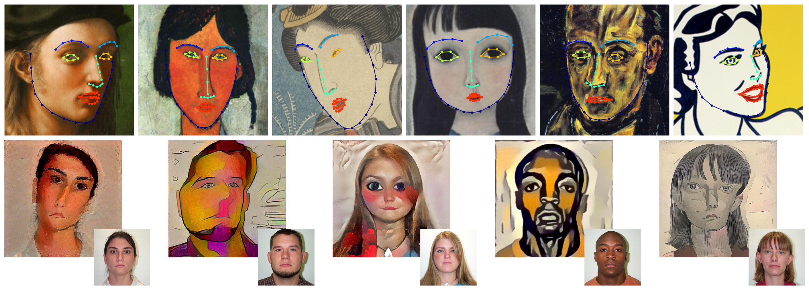

# The Face of Art: Landmark Detection and Geometric Style in Portraits

Code for the landmark detection framework described in [The Face of Art: Landmark Detection and Geometric Style in Portraits](http://www.faculty.idc.ac.il/arik/site/foa/face-of-art.asp) (SIGGRAPH 2019)


<sub><sup>Top: landmark detection results on artistic portraits with different styles allows to define the geometric style of an artist. Bottom: results of the style transfer of portraits using various artists' geometric style, including Amedeo Modigliani, Pablo Picasso, Margaret Keane, Fernand Léger, and Tsuguharu Foujita. Top right portrait is from 'Woman with Peanuts,' ©1962, Estate of Roy Lichtenstein.</sup></sub>

## Getting Started

### Requirements

* python
* anaconda

### Download

#### Model
download model weights from [here](https://www.dropbox.com/sh/hrxcyug1bmbj6cs/AAAxq_zI5eawcLjM8zvUwaXha?dl=0).

#### Datasets
* The datasets used for training and evaluating our model can be found [here](https://ibug.doc.ic.ac.uk/resources/facial-point-annotations/).

* The Artistic-Faces dataset can be found [here](http://www.faculty.idc.ac.il/arik/site/foa/artistic-faces-dataset.asp).

* Training images with texture augmentation can be found [here](https://www.dropbox.com/sh/av2k1i1082z0nie/AAC5qV1E2UkqpDLVsv7TazMta?dl=0).
  before applying texture style transfer, the training images were cropped to the ground-truth face bounding-box with 25% margin. To crop training images, run the script `crop_training_set.py`.

* our model expects the following directory structure of landmark detection datasets: 
```
landmark_detection_datasets
    ├── training
    ├── test
    ├── challenging
    ├── common
    ├── full
    ├── crop_gt_margin_0.25 (cropped images of training set)
    └── crop_gt_margin_0.25_ns (cropped images of training set + texture style transfer)
```    
### Install

Create a virtual environment and install the following:
* opencv
* menpo
* menpofit
* tensorflow-gpu

for python 2:
```
conda create -n foa_env python=2.7 anaconda
source activate foa_env
conda install -c menpo opencv
conda install -c menpo menpo
conda install -c menpo menpofit
pip install tensorflow-gpu

```

for python 3:
```
conda create -n foa_env python=3.5 anaconda
source activate foa_env
conda install -c menpo opencv
conda install -c menpo menpo
conda install -c menpo menpofit
pip3 install tensorflow-gpu

```

Clone repository:

```
git clone https://github.com/papulke/deep_face_heatmaps
```

## Instructions

### Training

To train the network you need to run `train_heatmaps_network.py`

example for training a model with texture augmentation (100% of images) and geometric augmentation (~70% of images):
```
python train_heatmaps_network.py --output_dir='test_artistic_aug' --augment_geom=True \
--augment_texture=True --p_texture=1. --p_geom=0.7
```

### Testing 

For using the detection framework to predict landmarks, run the script `predict_landmarks.py`

## Acknowledgments

* [ect](https://github.com/HongwenZhang/ECT-FaceAlignment)
* [menpo](https://github.com/menpo/menpo)
* [menpofit](https://github.com/menpo/menpofit)
* [mdm](https://github.com/trigeorgis/mdm)
* [style transfer implementation](https://github.com/woodrush/neural-art-tf)
* [painter-by-numbers dataset](https://www.kaggle.com/c/painter-by-numbers/data)
